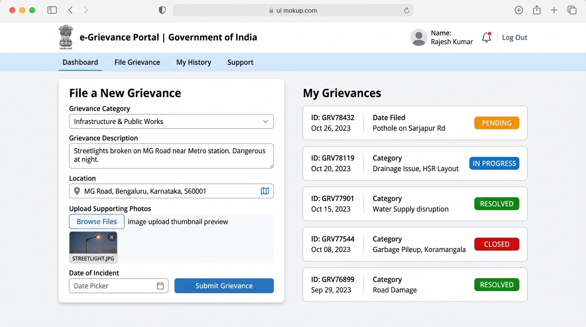
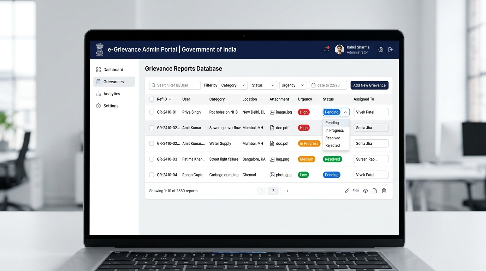

# Lok Nivaran Portal (Samadhan)

An official, secure, public grievance filing and monitoring portal developed under the **Department of Administrative Reforms & Public Grievances (DARPG), Government of India** guidelines. Designed to establish a seamless communication loop between citizens and administrative coordinators.

---

## 🌟 Key Features

### 🏢 Citizen Portal
- **File a Grievance**: Simple, frictionless form enabling citizens to catalog concerns.
- **Location Field Support**: Capture exact physical coordinates/room where the grievance resides.
- **LangChain AI Auto-Tagger**: Integrates LangChain NLP to analyze descriptions, auto-categorizing issues and prioritizing urgency level on the fly to reduce operational lag.
- **Image Attachments**: Attach photos to grievances using a secure `Multer`-powered multipart upload system, with instant drag-and-drop thumbnail previews.
- **My Grievances History**: Access list history of filed grievances, complete with color-coded status badges and attachment views.

### 🛡️ Administrative Portal (`/admin`)
- **Role-Based Access Control**: Highly protected routing system that validates administrative permissions; non-admin requests are shielded by an official government "Access Denied" screen.
- **Interactive Queue Database**: Multi-tenant table showing all citizen complaints in a centralized operational database.
- **State Transition Guard**: Updates status based on strict transition rules (`submitted` $\rightarrow$ `in-progress` $\rightarrow$ `resolved`) preventing direct bypass jumps.
- **Operational Assignment Inputs**: Dynamic assignee text fields that auto-save on blur or on pressing the Enter key to delegate tasks to specific departments or staff.
- **Query-Based Filtering**: Search query filters matching status (`?status=...`) and category (`?category=...`) directly via database optimizations.

### 🌗 Theme Toggle & Accessibility
- **Light Theme (Default)**: Follows official government portal design schemes with deep navy-blue primary accents, saffron/saffron-gold overlays, clean white cards, and high contrast texts.
- **Dark Theme**: Fully calibrated accessibility option utilizing deep dark-blue slate palettes for night-time operation.
- **LocalStorage Persistence**: Choice of theme is saved inside user sessions for persistent loading.

---

## 📸 Screenshots in Action

### Citizen Portal Dashboard


### Administrative Queue Panel


---

## 🛠️ Technical Stack

- **Frontend**: React (Vite), custom client-side History-API router, Vanilla CSS Variables.
- **Backend**: Node.js, Express, Multer, JSON Web Tokens (JWT) Auth.
- **Database**: TiDB / MySQL (mysql2 client).
- **Artificial Intelligence**: LangChain, OpenAI GPT API for automated classification.

---

## ⚙️ Development Setup

### Database Configuration
Ensure a MySQL/TiDB database instance is running and has the following tables initialized:
```sql
CREATE TABLE users (
  id INT AUTO_INCREMENT PRIMARY KEY,
  name VARCHAR(100) NOT NULL,
  email VARCHAR(100) UNIQUE NOT NULL,
  password_hash VARCHAR(255) NOT NULL,
  is_admin TINYINT(1) DEFAULT 0,
  created_at TIMESTAMP DEFAULT CURRENT_TIMESTAMP
);

CREATE TABLE grievances (
  id INT AUTO_INCREMENT PRIMARY KEY,
  user_id INT NOT NULL,
  category VARCHAR(100) NOT NULL,
  description TEXT NOT NULL,
  status ENUM('submitted', 'in-progress', 'resolved') NOT NULL DEFAULT 'submitted',
  urgency ENUM('Low', 'Medium', 'High', 'Critical') DEFAULT 'Low',
  location VARCHAR(255) DEFAULT NULL,
  image_url VARCHAR(255) DEFAULT NULL,
  assigned_to VARCHAR(100) DEFAULT NULL,
  created_at TIMESTAMP DEFAULT CURRENT_TIMESTAMP,
  FOREIGN KEY (user_id) REFERENCES users(id) ON DELETE CASCADE
);
```

### Backend Setup
1. Open the `/backend` folder.
2. Configure `.env` variables:
   ```env
   DB_HOST=<database_host>
   DB_PORT=<database_port>
   DB_USER=<database_username>
   DB_PASS=<database_password>
   DB_NAME=<database_name>
   JWT_SECRET=<jwt_signing_key>
   OPENAI_API_KEY=<openai_key>
   ```
3. Install dependencies and run seeding script to populate testing records:
   ```bash
   npm install
   node seed.js
   ```
4. Start the server:
   ```bash
   npm start
   ```

### Frontend Setup
1. Open the `/frontend` folder.
2. Install dependencies:
   ```bash
   npm install
   ```
3. Launch development server:
   ```bash
   npm run dev
   ```

---

## 🔑 Default Test Credentials
- **Administrative Account**:
  - Email: `admin@egrp.gov.in`
  - Password: `admin123`
- **Citizen Account**:
  - Email: `citizen@example.com`
  - Password: `citizen123`
